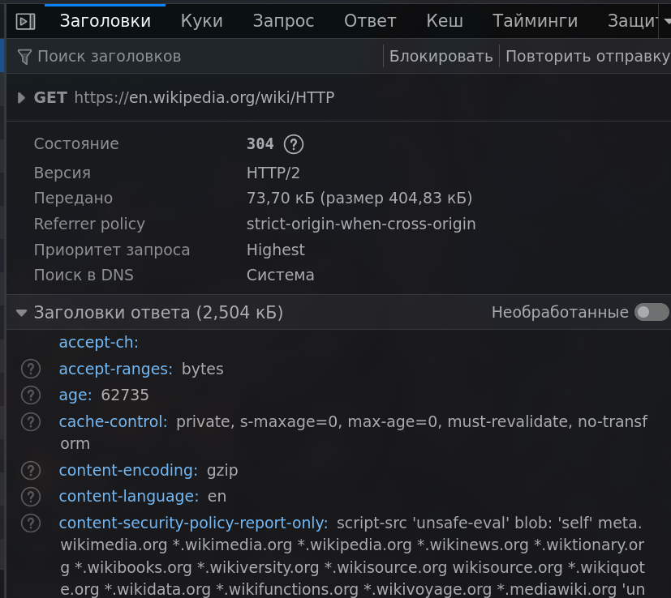
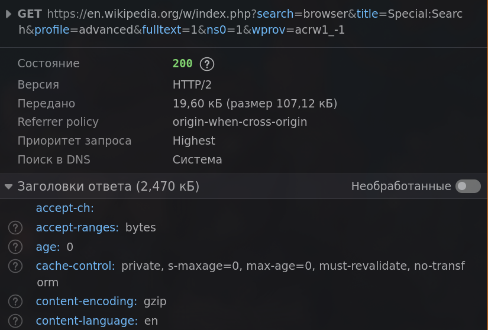

# Лабораторная работа №1

## Студент: Кроитор Александр

## Преподаватель: Никита Нартя

## Группа: IA2403 (ru)

### Задание 1 Анализ HTTP-запросов. Часть 1

Открываем сайт Wikipedia https://en.wikipedia.org/wiki/HTTP

Читаем про HTTP протокол, так называемый Hypertext Transfer Protocol

Открываем Dev mode в браузере и перезагружаем страницу, находясь в вкладке Network

Видим GET запрос:

```http
GET https://en.wikipedia.org/wiki/HTTP
```

ну и базовое описание:

```conf
Состояние 304
ВерсияHTTP/2
Передано73,70 кБ (размер 404,83 кБ)
Referrer policystrict-origin-when-cross-origin
Приоритет запросаHighest
Поиск в DNSСистема
```

GET - метод http протокола, означает получить данные, не изменяя ничего.

Состояние 304 явно показывает отсутствие необходимости в изменении данных на странице и факт ссылания на кэш

Заголовков ответа и запросов достаточно много, поэтому сконцетрируюсь на ключевых:

- content-type text/html; charset=UTF-8, тип присылаемого ответа, помогает сервису (в данном случае фронтенду) понять как обработать запрос, в данном случае его нужно отобразить, то логично
- Vary: Accept-Encoding,X-Subdomain,Cookie,Authorization,User-Agent. Заголовок ответа Vary определяет, как сопоставить будущие заголовки запроса, чтобы решить, можно ли использовать кешированный ответ, а не запрашивать новый с исходного сервера.
- Accept text/html,application/xhtml+xml,application/xml;q=0.9,_/_;q=0.8 - тип принимаемых ответов
- Accept-Encoding gzip, deflate, br, zstd, принимаемые методы шифрования
- Cookie WMF...215b32c - куки, так называемый ключ к кэшу моей сессии
- User-Agent Mozilla/5.0 (X11; Linux x86_64; rv:145.0) Gecko/20100101 Firefox/145.0. User-Agent - это строка с характеристиками, по которым сервера и сетевые узлы могут определить тип приложения, операционную систему, производителя и/или версию пользовательского агента.

В запросе ничего нет, так как сам http query содержит достаточно информации в себе, ссылаясь на конкретную страницу HTTP, когда же ответ содержить html структуру страницы



Так же на странице были запросы на получение стилей, svg картинок, js скриптов, аналогично Get, но уже с статусом - 200, то есть успешный запрос.

При запросе же на https://en.wikipedia.org/wiki/HTTPdsfdfs

Запрос происходит ровно в таком же формате

```http
GET https://en.wikipedia.org/wiki/HTTPdsfdfs
```

Однако статус ответа является 404, так называемое - не найдено. В целом все 400-499 коды ошибок

1xx - информационные
2xx - успешные
3xx - перенаправления
4xx - ошибка клиента
5xx - ошибки сервера

### Задание 2. Анализ HTTP-запросов. Часть 2

Переходим на страницу https://en.wikipedia.org/wiki/Special:Search

```http
GET https://en.wikipedia.org/w/index.php?search=browser&title=Special:Search&profile=advanced&fulltext=1&ns0=1&wprov=acrw1_-1
```

Видим, что URL запроса содержит так называемые querys, в сути это переменные данные, которые мы хотим чтобы сервер обработал и вернул нам данные. search=browser - поиск по слову, title=Special:Search название, fulltext=1 флаг true и так далее
Так как введённые наши данные не меняют данные на сервере, а только читает, то запрос всё ещё остаётся GET.



### Задание 3. Анализ HTTP-запросов. Часть 3

Делаем запрос на https://github.com, очевидно, что при входе на страницу мы создаём HTTP запрос на / (корневая страница сайта), поэтому сделаю запрос отдельно, чтобы просмотреть что нам вернётся

```bash
curlie GET https://github.com/ | head -1
Note: Unnecessary use of -X or --request, GET is already inferred.
HTTP/2 200
date: Fri, 13 Feb 2026 01:25:12 GMT

content-type: text/html; charset=utf-8
vary: X-PJAX, X-PJAX-Container, Turbo-Visit, Turbo-Frame, X-Requested-With, Accept-Language, Sec-Fetch-Site,Accept-Encoding, Accept, X-Requested-With
content-language: en-US
etag: W/"ca1d7ed9a51ea44fec229595294f2057"
cache-control: max-age=0, private, must-revalidate
strict-transport-security: max-age=31536000; includeSubdomains; preload
x-frame-options: deny
x-content-type-options: nosniff
x-xss-protection: 0
referrer-policy: origin-when-cross-origin, strict-origin-when-cross-origin
```

Видим, что возвращаемое значение - html

Базовые методы HTTP запроса:
**GET** - Получение данных без изменения данных
**POST** - Отправить данные на сервер и создать ресурс
**PUT** - Полностью изменить ресурс
**PATCH** - Частично обновить ресурс
**DELETE** - Удалить ресурс

Создам GET запрос к серверу по аддресу

1

```bash
 http GET https://example.com \
  User-Agent:"MyCustomClient/1.0"
```

2

```bash
http POST http://sandbox.usm.com \

  make=Toyota \
  model=Corolla \
  year:=2020
```

3

```bash
http PUT http://sandbox.usm.com/1 \

  make=Toyota \
  model=Corolla \
  year:=2021
`
```

= - для строки
:= - для чисел в json

4

```http
POST /cars HTTP/1.1
Host: sandbox.com
Content-Type: application/json
User-Agent: John Doe
model=Corolla&make=Toyota&year=2020

```

В случае этого запроса может вернуться

```http
HTTP/1.1 201 Created
Content-Type: application/json
Location: /cars/2
```

```json
{
  "id": 2,
  "make": "Toyota",
  "model": "Corolla",
  "year": 2020
}
```

200 может возвращаться в случае успешного получения данных, 201 в случае успешного создания объекта на сервере, 400 в случае некорректного запроса, 401 ошибка в случае запроса неавторизованного пользователя там, где это необходимо, 403 - запрос понят, но не разрешён, 404, если запрос не найдке, 500 ошибка в случае ошибки на сервере
